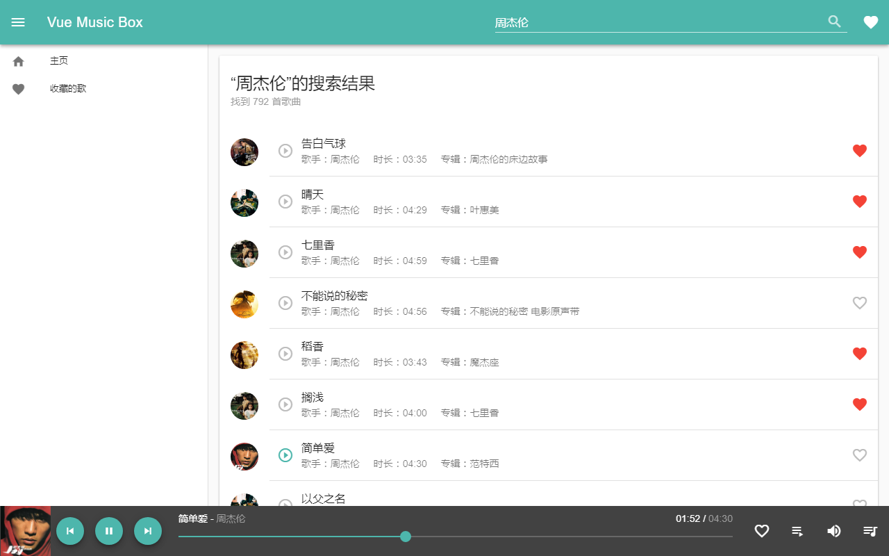

# Vue Music Box

一个由**Vue**技术栈实践的音乐播放器练手项目

## 主要技术栈：

  - **Vue**
  - **Vue Router**
  - **Vuetify**
  - **HTML5 Audio**
  - **ES6 + ES7**
  - **Webpack**

## 相关链接

[在线Demo](https://flyerq.github.io/vue-music-box/ "Demo")

## Demo 截图

